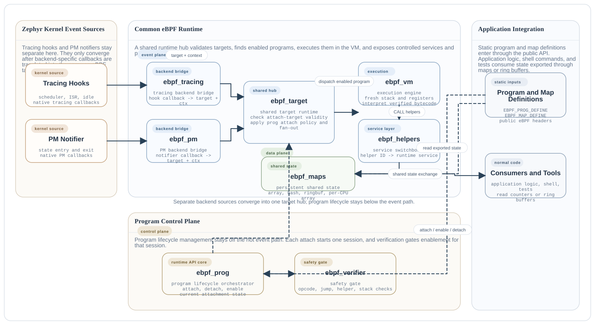

Architecture
############

The subsystem is easiest to understand as two paths that meet in the runtime:

* the control path prepares programs to run,
* the event path executes enabled programs when a backend target fires.

The short mental model is:

* :zephyr_file:`subsys/ebpf/ebpf_prog.c` is the program lifecycle orchestrator,
* :zephyr_file:`subsys/ebpf/ebpf_attach_target.c` is the common attach-target
   runtime for all backends,
* :zephyr_file:`subsys/ebpf/ebpf_verifier.c` is the safety gate,
* :zephyr_file:`subsys/ebpf/backends/ebpf_tracing.c` and
   :zephyr_file:`subsys/ebpf/backends/ebpf_pm.c` are backend bridges,
* :zephyr_file:`subsys/ebpf/ebpf_vm.c` is the execution engine,
* :zephyr_file:`subsys/ebpf/ebpf_helpers.c` is the helper switchboard,
* :zephyr_file:`subsys/ebpf/ebpf_maps.c` is the shared state store.

Subsystem Diagram
*****************

  Zephyr eBPF subsystem architecture.

Control Path
************

The control path is entered when application code manages a program. The
responsibilities are intentionally concentrated away from the hot event path.

1. A program descriptor and any maps are registered statically.
2. :zephyr_file:`subsys/ebpf/ebpf_prog.c` accepts an attach request.
3. :zephyr_file:`subsys/ebpf/ebpf_attach_target.c` checks whether the concrete
   :c:type:`ebpf_attach_target` is valid and whether the current program type
   can attach to it.
4. A new attachment begins. The program enters the ``attached`` state and
   current-attachment statistics are reset.
5. When the program is enabled, :zephyr_file:`subsys/ebpf/ebpf_verifier.c`
   validates the bytecode for the current attachment against the resolved
   target contract.
6. After verification succeeds, the program enters the ``enabled`` state and is
   eligible to run when its target fires.

Event Path
**********

The event path is entered when a backend observes a real system event.

1. A backend bridge such as :zephyr_file:`subsys/ebpf/backends/ebpf_tracing.c`
   or :zephyr_file:`subsys/ebpf/backends/ebpf_pm.c` translates the native event into
   :c:type:`ebpf_attach_target` plus a backend-specific context object. The
   tracing backend is wired through Zephyr's tracing-user callback layer rather
   than through custom trace macros in generic headers.
2. :zephyr_file:`subsys/ebpf/ebpf_attach_target.c` finds every enabled program bound
   to that target.
3. For each matching program, :zephyr_file:`subsys/ebpf/ebpf_vm.c` creates a
   fresh VM invocation with a clean register file and private stack.
4. The VM exposes the event context through register ``R1``.
5. A shared target contract determines which helpers are allowed and whether
   the event context passed in ``R1`` is read-only for that backend and
   program family.
6. Helper calls are resolved by :zephyr_file:`subsys/ebpf/ebpf_helpers.c`.
7. Map operations are serviced by :zephyr_file:`subsys/ebpf/ebpf_maps.c`.
8. Optional runtime statistics are accumulated in the program's current
   attachment.

Core Runtime Model
******************

Several architectural choices explain the current subsystem shape:

* A program owns one current attachment at a time.
* A target may fan out to multiple enabled programs.
* Verification is scoped to the current attachment, not to the
  lifetime of the program descriptor.
* Execution statistics are also current-attachment state.
* Each enabled attachment resolves one target-specific contract keyed by
   ``(prog_type, backend, point)``.
* In the current implementation that contract owns two runtime-enforced
   policies only: the helper allowlist and whether the event context in ``R1``
   is read-only.
* The concrete layout of ``R1`` remains part of the backend target definition,
   such
   as :c:struct:`ebpf_ctx_thread`, :c:struct:`ebpf_ctx_isr`,
   :c:struct:`ebpf_ctx_idle`, or :c:struct:`ebpf_ctx_pm`.
* Backends own event capture; :zephyr_file:`subsys/ebpf/ebpf_attach_target.c`
   is the shared attach-target runtime for all backends and owns validity
   checks, naming, active checks, fan-out dispatch, and program-to-target
   compatibility policy.

This split keeps program lifecycle decisions out of the hot path and keeps
backend glue out of the generic runtime.
