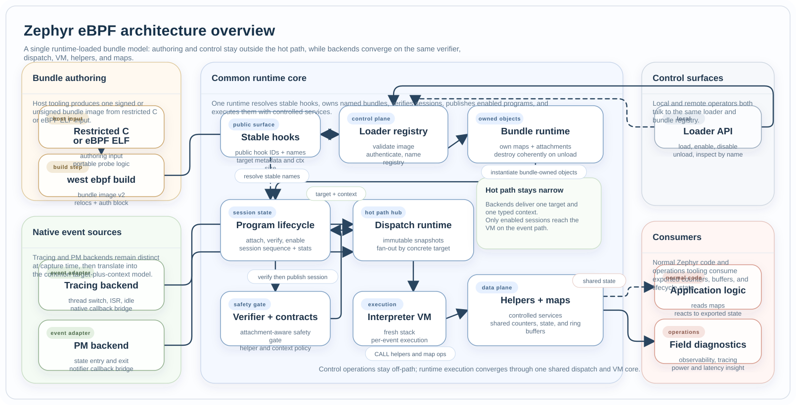

Architecture
############

The subsystem is easiest to understand as one loader-and-bundle architecture.

* Restricted C or eBPF ELF authoring produces one bundle image.
* The loader and MCUmgr control surfaces instantiate one named bundle from that
  image.
* Loaded bundles converge on the same stable hooks, verifier, VM, helpers,
  maps, and dispatch runtime.

This is the authoritative architecture description for the current
implementation. Runtime loading is no longer a future side design.

Overall Structure
*****************

    One-picture view of the current loader-and-bundle architecture: host-built
    bundles, named control surfaces, backend adapters, and the shared runtime
    core that verifies, publishes, and executes enabled sessions.

Unified Runtime Model
*********************

The current design centers on stable hooks, named bundles, loader handles, and
the runtime core beneath them.

Stable hooks
============

Stable hook IDs and names are the public attachment surface for runtime-loaded
probes. They translate into concrete
:c:type:`ebpf_attach_target` values and describe the context size a program
receives in register ``R1``.

Programs and attachments
========================

The public program lifecycle remains prog-centric. Each bundle-owned
:c:type:`ebpf_prog` moves through the same session states: detached, attached,
verified, and enabled.

Maps
====

Maps are the persistent state store. They are instantiated as part of bundle
load, then participate in the same helper lookup path and use the same runtime
IDs.

Bundles and loader handles
==========================

Runtime-loaded objects are grouped into bundles. The loader owns registry,
authentication, TTL, and name-based control. The bundle runtime owns the maps
and attachments instantiated from one image.

Loader And Bundle Flow
**********************

Host-built bundles carry code, maps, relocation metadata, optional
authentication, and optional TTL into the loader.

Control Path
************

The control path prepares programs to run while keeping mutable operations off
the hot event path.

1. The loader instantiates a runtime bundle from an image.
2. Stable hook APIs or bundle attachment metadata resolve a public hook name to
   a concrete :c:type:`ebpf_attach_target`.
3. :zephyr_file:`subsys/ebpf/prog/ebpf_prog.c` starts a new attachment session by
   binding a program to one concrete target.
4. On enable, :zephyr_file:`subsys/ebpf/ebpf_verifier.c` validates the program
   for the current attachment and resolves the shared contract for
   ``(prog_type, backend, point)``.
5. :zephyr_file:`subsys/ebpf/attach/ebpf_attach_target.c` publishes a new immutable
   snapshot for that target so the event path sees the new enabled session.
6. Disable, detach, and unload operations publish a new snapshot that omits the
   retired program, and bundle-owned teardown waits for quiescence when
   required.

Event Path
**********

The event path stays short and synchronous.

1. A backend bridge translates a native event into one concrete target plus a
   typed context object.
2. The target runtime acquires the current immutable snapshot for that target.
3. Each dispatch entry executes in its own VM invocation with a fresh register
   file and private stack.
4. The VM exposes the event context through register ``R1``.
5. Helper calls go through :zephyr_file:`subsys/ebpf/helpers/ebpf_helpers.c`, and map
   operations go through :zephyr_file:`subsys/ebpf/map/ebpf_map_core.c`.

Hot-Path Safety Model
*********************

The most important hot-path rule is that enabled dispatch state is immutable.

Each concrete target owns an atomic pointer to a snapshot containing the list
of enabled programs for that target. Readers increment the snapshot reader
count, iterate the compact attachment array, and drop the count on exit.
Control-plane updates prepare the alternate snapshot buffer, publish it
atomically, and optionally wait for the retired snapshot to drain before
tearing down bundle-owned objects.

This is what keeps enable, disable, detach, and unload operations from racing
the event path.

Contract Model
**************

The current contract table is intentionally small. It is keyed by
``(prog_type, backend, point)`` and currently carries two executable policies:

* which helper IDs are legal for that attachment,
* whether the event context passed in ``R1`` is read-only.

Backends still own the concrete context layouts such as
:c:struct:`ebpf_ctx_thread`, :c:struct:`ebpf_ctx_isr`,
:c:struct:`ebpf_ctx_idle`, and :c:struct:`ebpf_ctx_pm`. The verifier and the VM
both consult the same resolved contract so helper policy and runtime behavior
stay aligned.

Where To Dive Deeper
********************

* Read :doc:`components/hook_model` for the stable public hook surface.
* Read :doc:`components/dispatch_runtime` for the snapshot publication model.
* Read :doc:`components/verifier_and_contracts` for attachment-aware safety
  rules.
* Read :doc:`components/loader` for bundle authentication, registry, and TTL.
