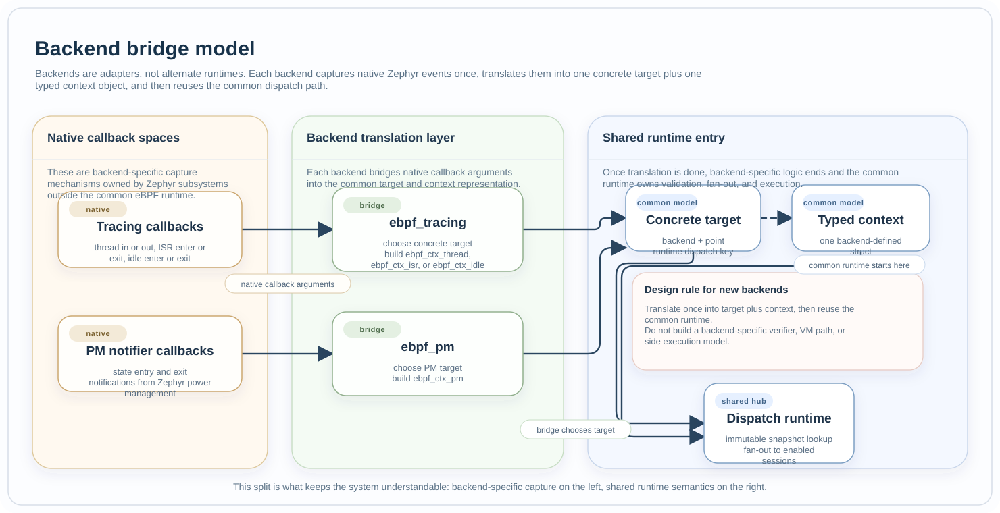

Backends
########

Files:

* :zephyr_file:`subsys/ebpf/attach/backends/ebpf_tracing.c`
* :zephyr_file:`subsys/ebpf/attach/backends/ebpf_pm.c`

Role
****

Backends are the event-source adapters. They translate native Zephyr events
into the common eBPF model of one concrete target plus one typed context
object.

Current Backends
****************

  Backends are adapters, not parallel runtimes. They capture native events,
  translate them into one concrete target plus one typed context object, and
  then hand control to the shared dispatch path.

Tracing backend
===============

The tracing backend uses Zephyr tracing-user callbacks to observe:

* thread switched in,
* thread switched out,
* ISR enter,
* ISR exit,
* idle enter,
* idle exit.

It then builds the matching context object and dispatches to the common target
runtime.

PM backend
==========

The PM backend hooks Zephyr PM notifier callbacks for:

* state entry,
* state exit.

It translates those notifications into :c:struct:`ebpf_ctx_pm` and dispatches
them through the same common runtime.

Collaborates With
*****************

* :doc:`dispatch_runtime` receives the translated target plus context pair.
* :doc:`hook_model` documents the stable names associated with these events.
* :doc:`verifier_and_contracts` constrains helper policy per backend and point.

Design Limits
*************

* Backends own native event capture and concrete context layout.
* The common runtime should not need to know backend-specific capture details.
* New backends should translate once into the common target-plus-context model
  instead of inventing a parallel execution path.