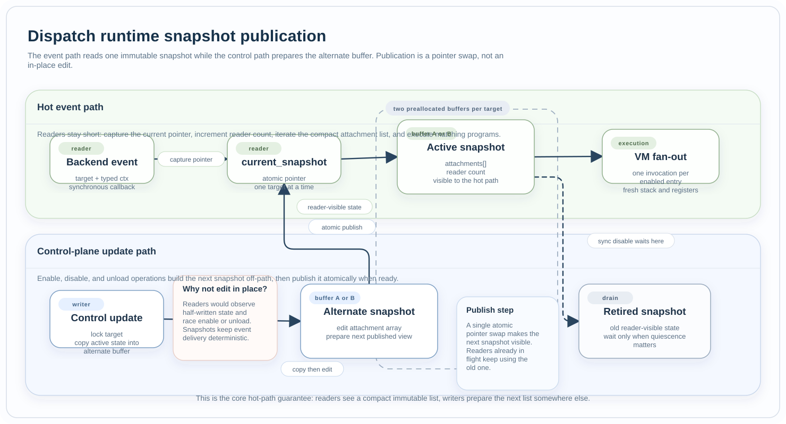

Dispatch Runtime
################

Files:

* :zephyr_file:`include/zephyr/ebpf/ebpf_ctx.h`
* :zephyr_file:`subsys/ebpf/attach/target/target_types.h`
* :zephyr_file:`subsys/ebpf/attach/target/target.c`

Role
****

This component is the common runtime hub for concrete attachment targets shared
by all backends. It owns target validation, program-to-target compatibility,
enabled-program publication, and event fan-out.

Its most important job is to keep the event path race-free while control-plane
operations enable, disable, detach, or unload programs.

Snapshot Publication Model
**************************

  Readers and writers intentionally live on different paths. The hot path only
  sees the current immutable snapshot, while control-plane updates prepare the
  alternate buffer and publish it with one pointer swap.

The implementation uses two preallocated snapshot buffers per concrete target.
Readers increment the active snapshot's reader count before iterating its
attachment array. Writers prepare the alternate snapshot, publish it with an
atomic pointer swap, and wait for reader drain only when synchronous quiescence
is required.

Owns
****

* backend namespace tables for tracing and PM targets,
* concrete target validation,
* program-type compatibility checks,
* active-target queries,
* immutable per-target snapshot publication,
* event fan-out into the VM.

Collaborates With
*****************

* :doc:`program_lifecycle` asks this component to publish or remove enabled
  sessions.
* :doc:`backends` call into the dispatch runtime when a native event occurs.
* :doc:`virtual_machine` executes each matching program.
* :doc:`bundle_runtime` relies on synchronous disable when bundle-owned
  attachments are destroyed.

Design Limits
*************

* One target may fan out to multiple enabled programs.
* The maximum published fan-out per target is bounded by
  :kconfig:option:`CONFIG_EBPF_MAX_ATTACHMENTS_PER_TARGET`.
* Dispatch assumes backend callbacks are synchronous and should stay short.
* Execution-relevant state must be part of the immutable snapshot rather than a
  mutable side structure reread on the hot path.