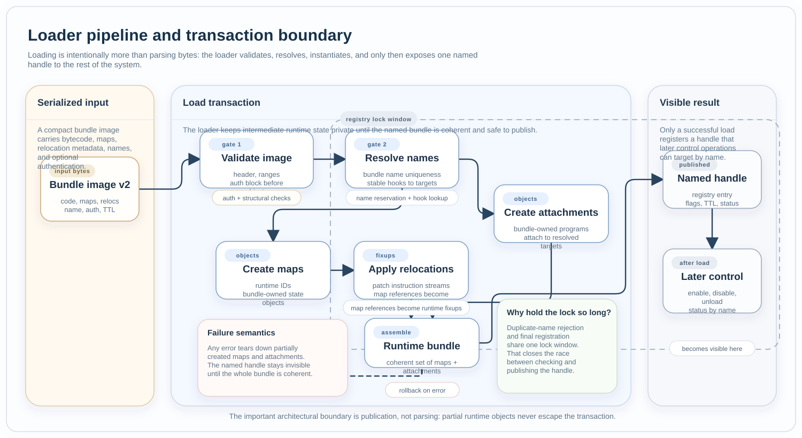

Loader
######

Files:

* :zephyr_file:`include/zephyr/ebpf/ebpf_loader.h`
* :zephyr_file:`subsys/ebpf/loader/ebpf_loader.c`
* :zephyr_file:`scripts/west_commands/ebpf.py`

Role
****

The loader turns a serialized bundle image into a named runtime handle. It owns
image validation, authentication, bundle instantiation, registry management,
TTL handling, and name-based lifecycle control.

Load Pipeline
*************

  The loader's architectural boundary is publication, not parsing. Validation,
  name resolution, map and attachment creation, and final registration all sit
  inside one private transaction before the named handle becomes visible.

The loader instantiates maps and attachments but does not automatically enable
them unless a higher-level control plane requests that step.

Authentication
**************

The current image format supports three authentication modes:

* none,
* CRC32 for corruption detection,
* ECDSA P-256 over SHA-256 for signature verification against the configured
  pinned public key.

Authentication is checked before the loader creates any bundle-owned objects.

Owns
****

* image format validation,
* authentication block validation,
* named loader-handle registry,
* enable, disable, unload, and status-by-name operations,
* TTL timers and auto-unload bookkeeping.

Collaborates With
*****************

* :doc:`../authoring` produces the images this component consumes.
* :doc:`hook_model` resolves stable hook names to concrete targets.
* :doc:`bundle_runtime` owns the instantiated maps and attachments.
* :doc:`operations` exposes the loader through MCUmgr.

Design Limits
*************

* The target consumes the compact loader image, not ELF directly.
* Runtime loading is transactional: the image either becomes a coherent named
  bundle or the operation fails.
* Bundle control is name-based once the handle is registered.
* TTL expiry destroys the owned bundle and records that the handle was
  auto-unloaded.