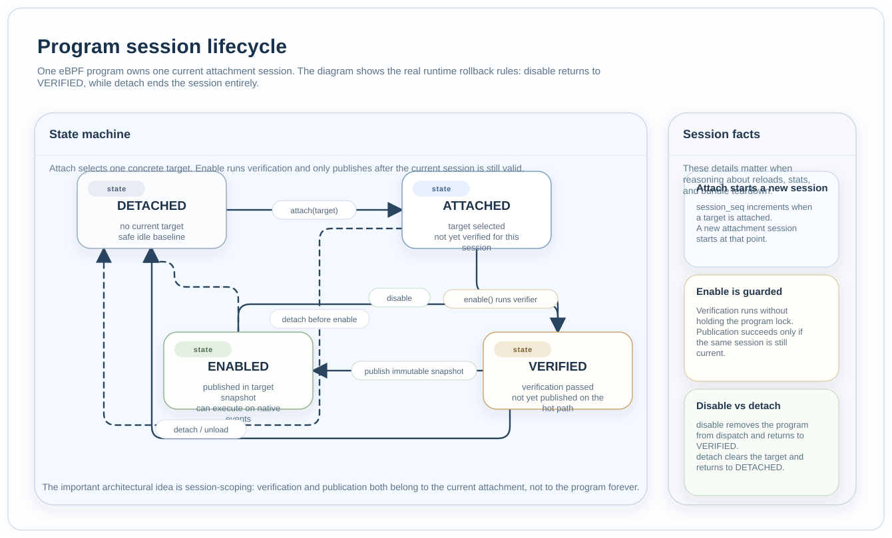

Program Lifecycle
#################

Files:

* :zephyr_file:`include/zephyr/ebpf/ebpf_prog.h`
* :zephyr_file:`subsys/ebpf/prog/prog.c`

Role
****

This component owns the control-plane lifecycle of one program's current
attachment session. It does not execute bytecode itself. Instead, it manages
the state transitions that determine whether a program is detached, attached,
verified, or enabled.

State Model
***********

The current session model is:

* ``DETACHED``: the program is not bound to any target,
* ``ATTACHED``: the program is bound to a concrete target but has not yet been
  verified for this session,
* ``VERIFIED``: verification succeeded for the current session,
* ``ENABLED``: the current session has been published into the target runtime.

Each successful attach increments the session sequence number and starts a new
current attachment session. Verification is therefore session-scoped rather
than a program-lifetime property.

  One program owns one current attachment session. The key semantic split is
  that disable returns the session to ``VERIFIED``, while detach ends the
  session and returns the program to ``DETACHED``.

Owns
****

* attach and detach transitions,
* verify-on-enable behavior,
* session sequence tracking,
* runtime initialization for bundle-owned program descriptors.

Collaborates With
*****************

* :doc:`dispatch_runtime` validates targets and publishes enabled sessions.
* :doc:`verifier_and_contracts` checks the program for the current attachment.
* :doc:`hook_model` offers hook-centric attach helpers on top of concrete
  targets.
* :doc:`bundle_runtime` creates bundle-owned program descriptors that use the
  same lifecycle as any other live program descriptor.

Design Limits
*************

* One program owns one current target at a time.
* Reattaching starts a new session rather than mutating an old verified one.
* Verification is intentionally repeated when the target changes.
* Disable and detach are separate operations: disable preserves the attachment,
  while detach ends the session.