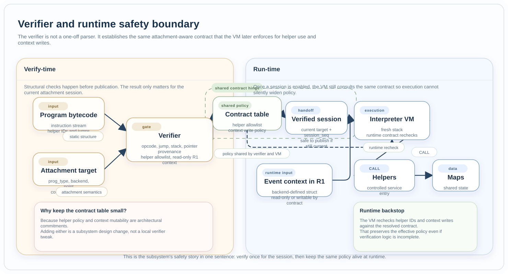

Verifier And Contracts
######################

Files:

* :zephyr_file:`subsys/ebpf/ebpf_verifier.c`
* :zephyr_file:`subsys/ebpf/ebpf_contract.c`
* :zephyr_file:`subsys/ebpf/ebpf_contract.h`

Role
****

The verifier is the subsystem's safety gate. Its job is to reject malformed or
unsafe bytecode before a program reaches the hot event path. The shared
contract table supplies the attachment-aware policy that both verifier and VM
must agree on.

What It Checks Today
********************

The current verifier enforces a practical subset of eBPF safety rules,
including:

* instruction-count and encoding checks,
* register validation,
* jump-target validation,
* helper ID validation,
* stack bounds,
* map-related pointer provenance,
* read-only protection for the event context passed in ``R1``,
* attachment-aware helper allowlists.

Compiler-generated 64-bit immediate loads are part of the accepted instruction
set, so clang-produced objects do not need a separate instruction subset.

  The same attachment-aware contract spans both phases: the verifier decides
  the policy for the current session, and the VM rechecks that policy at
  runtime so execution cannot silently widen it.

Contract Table
**************

The contract table is keyed by ``(prog_type, backend, point)``. In the current
implementation it carries two executable policies only:

* the helper allowlist for that attachment,
* whether the event context in ``R1`` is read-only.

The concrete layout of the event context remains backend-defined and documented
through the public context structs.

Collaborates With
*****************

* :doc:`program_lifecycle` calls the verifier on enable.
* :doc:`helpers` must stay aligned with helper allowlist policy.
* :doc:`virtual_machine` rechecks the resolved contract at runtime so verifier
  policy and execution behavior do not diverge.
* :doc:`backends` define the concrete contexts that verifier policy reasons
  about indirectly.

Design Limits
*************

* The verifier is intentionally lightweight compared to Linux eBPF.
* Verification is scoped to the current attachment session.
* The contract table is intentionally narrow and stores only policy consumed by
  common runtime code.
* Adding helpers or writable context semantics is an architectural change, not
  a local verifier tweak.