# eBPF loader 在 subsystem 中的角色

> 临时笔记，未纳入 doc/ 构建。VS Code 内置 Mermaid 预览：右上角 "Open Preview"。

## 一句话

loader 是 **"字节 → 活对象" 的 one-shot 转换器 + 活对象的注册表**。它不在热路径上，不拥有运行时语义，只把一份序列化 image 翻译成一个已挂好、可被 enable 的 `ebpf_bundle`，并记录 handle 供后续生命周期控制。

## 三层职责

| 层 | 做什么 | 在 loader 里的位置 |
|---|---|---|
| **Trust boundary** | 把"未信任的 bytes"变成"已验证的 header + 数据区" | `image.c`（`validate_image` / `validate_auth` / `range_valid`）|
| **Instantiation** | 按 header 调用 bundle/map/attach API，把 image 的每条记录变成一个 live 对象 | `loader.c::create_maps` / `create_attachments` / `apply_relocs` |
| **Registry + lifecycle** | 提供 handle，名字去重，enable/disable/unload/foreach | `loader.c` 其余部分 |

**loader 自己不做**的事（给 reviewer 一个清晰切分）：

- 不做验证器工作（交给 `verifier.c` 在 `prog_enable` 时）
- 不做热路径 dispatch（交给 `attach/` 的 target snapshot）
- 不自己存程序字节码（交给 `prog/` 管理）
- 不直接操作 hooks（通过 `attach/hook.c` 的 name→target 翻译）

## 调用关系图

```mermaid
flowchart LR
    subgraph HOST["Host 构建期 (不在设备上)"]
        SRC["Restricted C<br/>or eBPF ELF"] --> WEST["west ebpf build<br/>scripts/west_commands/ebpf.py"]
        WEST --> IMG[("Probe image<br/>magic/ver/header<br/>+ records + auth")]
    end

    APP["Application code"] -->|"ebpf_loader_load(bytes)"| LOADER_BOX

    subgraph LOADER_BOX["loader/ — 本次讨论的主角"]
        direction TB
        IMAGEC["image.c<br/><i>trust boundary</i><br/>validate_image<br/>validate_auth<br/>range_valid / get_string"]
        LOADERC["loader.c<br/><i>instantiate + registry</i><br/>create_maps<br/>create_attachments<br/>apply_relocs<br/>handle registry + foreach"]
        IMAGEC -->|"header*"| LOADERC
    end

    IMG -. "bytes delivered at runtime" .-> LOADER_BOX

    LOADERC -->|"ebpf_bundle_create"| BUNDLE
    LOADERC -->|"ebpf_bundle_add_map"| BUNDLE
    LOADERC -->|"ebpf_bundle_add_attachment"| BUNDLE

    subgraph CORE["Runtime core (loader 不拥有, 只构造)"]
        direction TB
        BUNDLE["bundle/<br/>ebpf_bundle<br/><i>owns maps + attachments</i>"]
        MAP["map/<br/>ebpf_map"]
        PROG["prog/<br/>ebpf_prog"]
        ATTACH["attach/<br/>attachment + target + hook"]
        VERIFIER["verifier.c"]
        VM["vm/<br/>interpreter"]
        HELPERS["helpers/"]

        BUNDLE --> MAP
        BUNDLE --> ATTACH
        ATTACH --> PROG
        PROG -. "verified on enable" .-> VERIFIER
        ATTACH -. "dispatch snapshot" .-> VM
        VM --> HELPERS
        HELPERS --> MAP
    end

    APP -->|"ebpf_loader_enable(handle)"| LOADERC
    LOADERC -->|"ebpf_bundle_enable"| BUNDLE

    subgraph HOT["Hot path (loader 完全不参与)"]
        HOOK["stable hook fires<br/>(thread switch, PM, ...)"]
    end
    HOOK --> ATTACH

    APP -->|"map_lookup_copy(handle, map_name, key)"| LOADERC
    LOADERC -->|"ebpf_bundle_find_map<br/>+ ebpf_map_lookup_elem"| BUNDLE

    APP -->|"ebpf_loader_unload(handle)"| LOADERC
    LOADERC -->|"ebpf_bundle_destroy"| BUNDLE

    classDef boundary fill:#fff3cd,stroke:#b8860b,color:#000
    classDef registry fill:#cfe2ff,stroke:#0d6efd,color:#000
    classDef core fill:#d1e7dd,stroke:#198754,color:#000
    classDef host fill:#f8d7da,stroke:#842029,color:#000
    classDef app fill:#e2e3e5,stroke:#495057,color:#000

    class IMAGEC boundary
    class LOADERC registry
    class BUNDLE,MAP,PROG,ATTACH,VERIFIER,VM,HELPERS core
    class SRC,WEST,IMG host
    class APP,HOT,HOOK app
```

## 读图要点

1. **loader 只与 `bundle/` 直接对话**。对 `map/` / `attach/` / `prog/` / `verifier` / `vm` 的所有操作都经由 `bundle/` 的公开 API。这是为什么整个 loader 只 `#include "../bundle/bundle.h"`。

2. **image.c 是唯一的 trust boundary**。整个 subsystem 里只有 `image.c` 接触"未验证的指针算术"。一旦 `validate_image` 返回成功，下游 `loader.c` 就只看 header 结构体和 `get_string()` 的返回值。reviewer 要 audit 内存安全只需看这一个文件。

3. **loader 不参与 hot path**。`APP → load/enable` 和 `HOOK → attach → VM` 是两条不相交的路径。loader 只负责把对象安放到 attach target 的 dispatch snapshot 里，snapshot 一旦发布，loader 就退场。

4. **loader 不做策略决策**：
   - 不决定什么时候 enable（调用者决定）
   - 不决定什么时候 unload（调用者决定，TTL 已延迟到后续 patch）
   - 不决定 verifier 是否放行（`verifier.c` 决定）
   - 不决定 map 的后端实现（`map/backend/` 决定）

5. **handle 的唯一意义**是"让调用者在不暴露 bundle 指针的情况下控制 bundle"。这是为什么 `map_lookup_copy` 用 copy 语义——调用者不持有 bundle-owned map pointer，生命周期全由 handle 托管。

## 相关参考

- [doc/services/ebpf/images/ebpf_architecture_overview.svg](../doc/services/ebpf/images/ebpf_architecture_overview.svg) — 整个 subsystem 总览
- [doc/services/ebpf/images/ebpf_loader_pipeline.svg](../doc/services/ebpf/images/ebpf_loader_pipeline.svg) — loader 内部 load 流水线
- [doc/services/ebpf/components/loader.rst](../doc/services/ebpf/components/loader.rst) — 文字版组件描述
